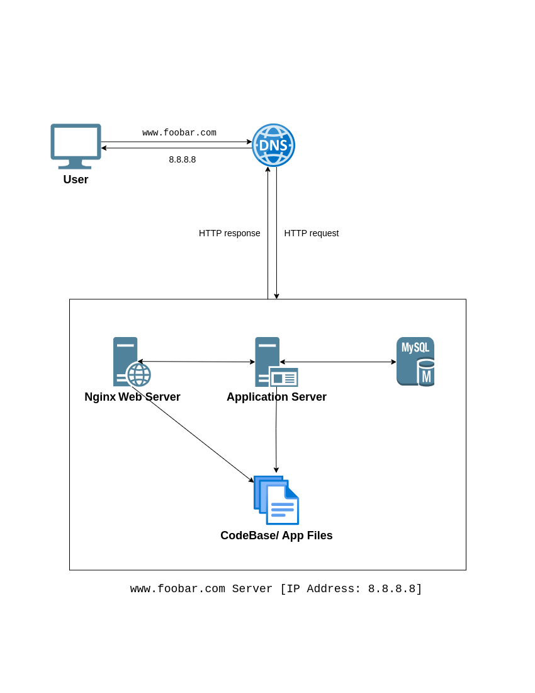

   
   
### specifics about this infrastructure:   
   
- **Server:** Stores all the website's files, databases, and applications.   
   
- **Domain Name:** This is the user-friendly address people type into their web browsers to reach your website.   
   
- **DNS Record (www):** It translates the domain name into the server's IP address that computers can understand.   
   
- **Web Server (Nginx):** It receives requests from the user's browser for website content. Nginx interprets these requests, finds the relevant files on the server, and sends them back to the browser in a format the browser can understand.   
   
- **Application Server:**  For websites with dynamic content, an application server sits behind the web server. It handles the dynamic functionalities using the website's codebase.   
   
- **Database (MySQL):** Storage system for website information. The application server can access and manipulate this data as needed to deliver dynamic content.   
   
- **Communication Protocol (HTTP):** The server uses the Hypertext Transfer Protocol (HTTP) to communicate with the user's web browser.  HTTP defines a set of rules for how data is formatted and exchanged between web browsers and servers.   
***   
   
### Limitations of this Single-Server Setup:   

- **Single Point of Failure (SPOF):** If the single server malfunctions or goes down, the entire website becomes inaccessible. There's no backup server to take over.   
   
- **Downtime during Maintenance:**  Restarting the web server (Nginx) for maintenance, like deploying new code, disrupts website access for some period.  There's no way to avoid this downtime with a single server.   
   
- **Limited Scalability:** This setup struggles with high volumes of traffic. The single server has a finite capacity, and if too many users try to access the website simultaneously, it can become overloaded, leading to slow performance.   
***   