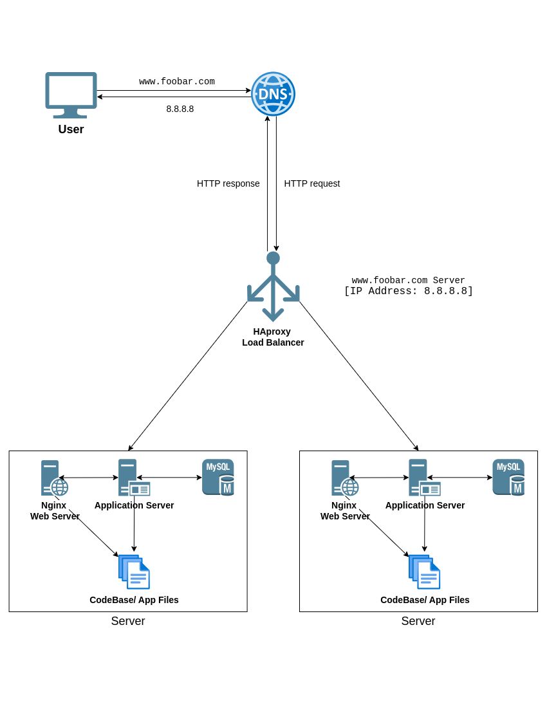

#### For every additional element, why you are adding it   
  
**Load Balancer (HAproxy):**  We added this to distribute user traffic across multiple web servers to improve overall performance by handling high traffic volumes more efficiently.   

**Two Web Servers (Nginx):**  These provide redundancy. If one web server fails, the other can take over, minimizing downtime for the website.   

**Database Cluster (Primary-Replica):**  This enhances data availability.   

**Primary Node:** This is the central database that stores all the website's data. The application server writes all data changes to the Primary Node for the most up-to-date information.   
**Replica Node:** This is a synchronized copy of the Primary Node, acting as a backup. In case of a Primary Node failure, the Replica can be promoted to become the new Primary, minimizing data loss.   
***
#### Load Balancer Distribution Algorithm (Round Robin)   
**Here's how Round Robin works:**   
- User requests arrive at the Load Balancer.   
- The Load Balancer sends the first request to Web Server 1 (Active).   
- The second request goes to Web Server 2 (Active), and so on.   
- The cycle repeats, distributing requests sequentially across all available web servers.   

**Active-Passive vs. Active-Active Load Balancing:**   
- Active-Passive: Only one web server actively handles traffic while the other is Passive.   
- Active-Active: Both web servers actively handle user requests, distributing the load and offering better performance and redundancy.   
***   
#### Database Primary-Replica Cluster:   
- The application server primarily writes data to the Primary Node.   
- The Replica Node is constantly synchronized with the Primary Node, ensuring an up-to-date copy of the data.   
- The application server can typically read data from either node, but often prioritizes the Replica to avoid impacting write performance on the Primary.   
*** 
#### Remaining SPOFs:   
- **Load Balancer:** If the Load Balancer fails, no traffic can reach the web servers.   
   
- **Database Primary Node:** If the Primary Node fails before the Replica can be promoted, there could be some data loss.   
***  
#### Security Issues:   
- **No Firewall:** Without a firewall in front of the Load Balancer and Web Servers, malicious traffic could potentially reach the website.   
   
- **No HTTPS:** Communication is not encrypted, making it vulnerable to eavesdropping and data breaches.   
   
- **Monitoring:** The lack of monitoring tools makes it difficult to proactively identify and address potential issues with servers, applications, or the database.   