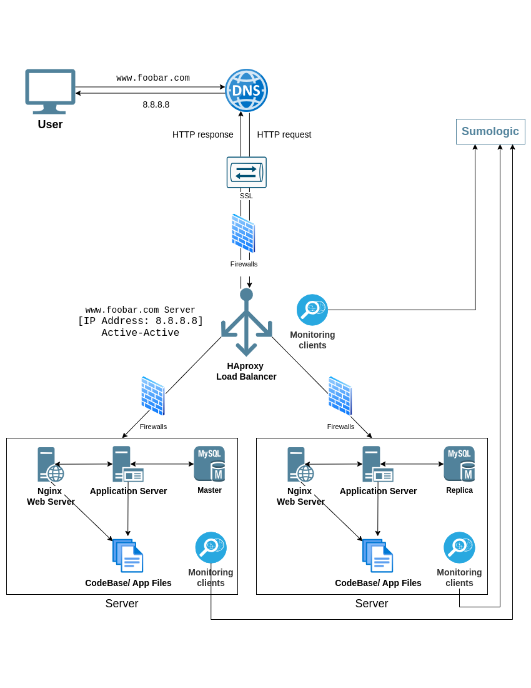

## Aspects:   
   
**Firewalls:**   
Firewalls act as security barriers between your internal network and the public internet.   
   
**HTTPS Traffic:**   
HTTPS encrypts communication between your web server and the client's browser. This protects sensitive data.   
   
**Monitoring:**   
Monitoring tools track various aspects of your infrastructure, including server performance, application health, and network activity. This allows you to identify and troubleshoot issues proactively.   

**Data Collection in Monitoring:**   
Monitoring tools employ various methods to collect data, such as:   
*Agents:* Software installed on servers or devices that continuously gather data and report it back to the monitoring tool.   
*APIs:* Programs can interact with the monitoring tool's API to provide performance metrics.   
*Log Files:* Monitoring tools can parse server logs for relevant information about system performance and errors.   

*Monitoring Web Server QPS (Queries Per Second):*   
To monitor your web server's QPS, you can use a monitoring tool that provides metrics related to HTTP requests. Look for tools that offer dashboards or reports displaying QPS over time. This allows you to identify traffic spikes and potential bottlenecks.   
***

### Infrastructure Issues:
   
**Terminating SSL at Load Balancer:**   
*Issue:* The web server doesn't "see" the HTTPS connection because it receives unencrypted traffic from the load balancer. This can be problematic for features that rely on knowing the secure connection.   
*Solution:*   
- SSL Termination on Web Servers: Decrypt SSL at the web server level for full visibility into the secure connection.   
- End-to-End Encryption: If the load balancer is within a secure network, consider end-to-end encryption where the client encrypts directly for the web server.   
   
**Single MySQL Write Server:**   
*Issue:* A single write server creates a single point of failure (SPOF). If it fails, your application can't write data.   
*Solution:* Implement a database cluster with replication. This creates a primary write server with one or more read replicas that can handle read requests and potentially take over writes if the primary fails.  
    
**Monolithic Servers (Database, Web Server, Application Server):**   
*Issue:* Scaling becomes difficult. You may need to upgrade all components even if only one needs more resources.   
*Solution:* Consider a microservices architecture. Break down your application into smaller, independent services. Each service can be scaled independently and has a smaller blast radius in case of failure. You can choose different technologies for each service based on its specific needs.   
   